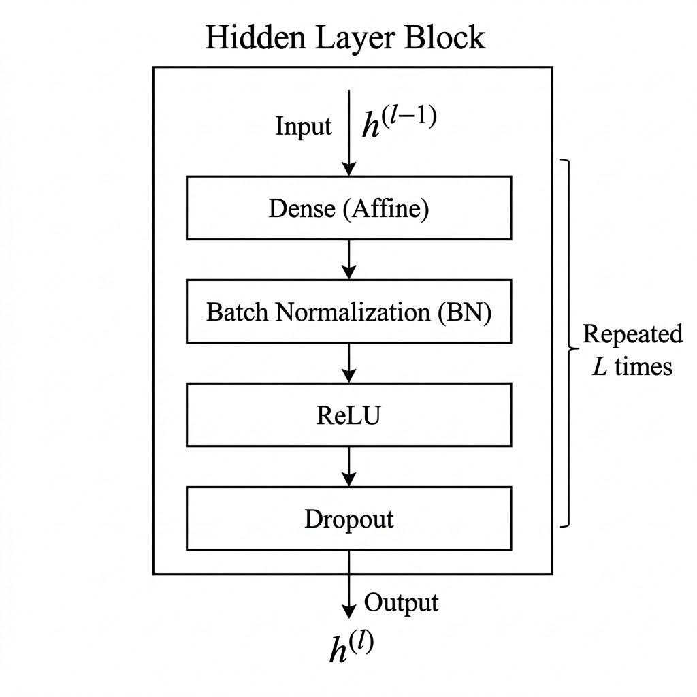

# Spherical DeepKriging

A deep learning framework for spatial prediction on the sphere, combining DeepKriging with spherical harmonic basis functions (MRTS-sphere), Wendland basis, and Universal Kriging.

---

### Available Basis Functions

The package currently provides the following basis families:

| Basis family | Module path | Role in this project |
|---|---|---|
| **MRTS-sphere** | `spherical_deepkriging.basis_functions.mrts_sphere` | **Primary basis (first choice)** for spherical-coordinate modeling in this project |
| **MRTS (Euclidean)** | `spherical_deepkriging.basis_functions.mrts` | Secondary/auxiliary basis for Euclidean reference experiments |
| **Wendland** | `spherical_deepkriging.basis_functions.wendland` | Secondary/auxiliary compact-support basis for baseline and comparison setups |

---

### Feedforward Backbone

The default feedforward hidden-block design is illustrated below:



---

### Prerequisites

Before you begin, ensure you have the following:

- **Conda**: Install [Conda](https://docs.conda.io/projects/conda/en/latest/user-guide/install/index.html) on your system.
- **Python 3.10**: Ensure Python 3.10 is installed.
- **CMake**: Included as part of Conda installation (if not, install manually).
- **GCC or Clang**: Install the appropriate compiler for your platform:
  - **macOS/Linux**: Use the system's default compiler or install via your package manager.
  - **Windows**: Not supported for C++ building due to compatibility issues.

---

### Installation

#### Step 1 — Set up WSL (Windows users only)

Open Windows PowerShell as Administrator and run:

```bash
wsl --install -d Ubuntu
```

Then open the Ubuntu terminal for all subsequent steps.

#### Step 2 — Install Conda

```bash
wget https://repo.anaconda.com/miniconda/Miniconda3-latest-Linux-x86_64.sh
bash Miniconda3-latest-Linux-x86_64.sh
~/miniconda3/bin/conda init bash
```

Close and reopen the terminal so that `conda` is available.

#### Step 3 — Clone the repository

```bash
cd ~
git clone https://github.com/STLABTW/deepkriging-sphere.git
cd deepkriging-sphere
```

#### Step 4 — Install system build tools (Linux / WSL)

```bash
sudo apt update
sudo apt install build-essential -y
```

#### Step 5 — Create the Conda environment

```bash
make install-dev
```

This will:
- Create a Conda environment named `spherical-deepkriging` (via `envs/conda/build_conda_env.sh`).
- Install essential tools like CMake, pybind11, and Armadillo.

#### Step 6 — Build C++ extensions

```bash
make build-spherical-cpp
```

This uses CMake to configure and build the spherical basis C++ extension.

#### Step 7 — Activate the environment

```bash
conda activate spherical-deepkriging
```

---

### Examples

Examples are organized under `examples/`:

- Quick module smoke test: `examples/toy/toy_sphere_deepkriging.ipynb`
- Paper simulations: `examples/simulation/`
- Real-data notebooks: `examples/real_data/`

For run instructions and detailed notes, see:

- `examples/README.md`

---

### Paper

The corresponding paper reference and citation will be added here in a later update.
